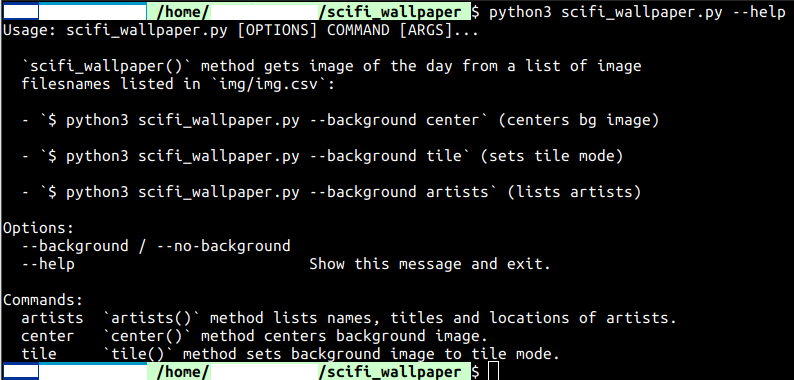

# scifi_wallpaper_mgr_nick3499
Python3: SciFi Wallpaper Manager: csv.reader(), datetime, shlex.split(), subprocess.run(), click

This repo has been made available under the open source [MIT](https://opensource.org/licenses/MIT) license.



Application tested using:
- Linux 5.4.0-14-generic
- Ubuntu 20.04 (Focal Fossa, dev branch)
- Python 3.8.2rc1
- GNU Bash 5.0.11 (x86_64-pc-linux-gnu)

Methods used:
- csv.reader()
- datetime.datetime.now().day
- shlex.split()
- subprocess.run()
- click.command(), option(), group(), echo()

## __init__.py

A Python application root directory should contain an empty `__init__.py` file which basically indicates that the application is a Python module.

## img/

One thing missing from this repo is an application subdirectory which contains **at least** 31 image files which are used as wallpaper images day by day. This repo features the cyberpunk genre.

## help

```shell
$ python3 scifi_wallpaper.py --help
```

The Bash string above will print command line help to the terminal emulator.

## click.group(), click.option(), click.command()

```python
@click.group()
@click.option('--background/--no-background', default=False)
def scifi_wallpaper(background):
    ...

@scifi_wallpaper.command()
def center():
    ...

@scifi_wallpaper.command()
def tile():
    ...

@scifi_wallpaper.command()
def artists():
    ...
```

- `click.group()` decorator method is used to group similar methods within the same module. For this app, it will `group()` three other methods with the `scifi_wallpaper()` method.
- `click.option()` decorator method makes the `--background` command line option available.
- `@scifi_wallpaper.command()` decorators are used to bind the additional methods to `scifi_wallpaper()` as commands.

`click` facilitates the execution of specific methods as commands in the command line:

- `$ python3 scifi_wallpaper.py --background center` sets the background wallpaper image as centered.
- `$ python3 scifi_wallpaper.py --background tile` sets the wallpaper to tile mode.
- `$ python3 scifi_wallpaper.py --background artists` prints a list of artists from a CSV database.

## Image Name Database

### .getlist

`csv/img.csv` is generated by sourcing the `.getlist` shell script which creates the database by redirecting stdout `$ ls img > img.csv` then juxtaposing status with `date` for the comparison of its moment of creation.

```shell
$ . .getlist
```

```shell
#! /bin/sh

ls img > csv/img.csv
sudo chown 1000:1000 csv/img.csv
sudo chmod 700 csv/img.csv
printf "\033[1;34mFile status:\033[0m\n"
stat csv/img.csv | grep Change
printf "\033[1;34mCurrent date:\033[0m\n"
date
```

`.getlist` prints something similar to the terminal emulator:

```shell
File status:
Change: 2020-02-23 17:20:54.515495972 -0600
Current date:
Sun 23 Feb 2020 05:20:54 PM CST
```

## with open()

```python
    image_database = 'csv/img.csv'
    with open(image_database) as _file:
        _reader = reader(_file)
        specific_row = [row for i, row in enumerate(_reader, 1)
                        if i == (datetime.now().day)]
        click.echo(f"wallpaper file: \x1b[0;36m{specific_row[0][0]}\x1b[0m")

    cli_args = 'gsettings set org.gnome.desktop.background picture-uri \
file:///home/foo/scripts/scifi_wallpaper/img/' + specific_row[0][0]
    cli_args_list = split(cli_args)
    run(cli_args_list)
```

- `image_database` has the path `csv/img.csv` assigned to it.
- `image_database` then becomes an argument passed to `with open()` which creates a [file object](https://www.programiz.com/python-programming/file-operation#open).
- `_file` is the file object, or _handle_, which is passed to the `csv.reader()` method. `csv.reader()` returns `_reader`.
- `[row for i, row in enumerate(_reader, 1) if i == (datetime.now().day)]` comprehension prints the record or row in `_reader` which corresponds with the current date number of the current month, and is stored in `specific_row`. Specifically, it is the image filename which will be set as the desktop background picture to be displayed, using `gsettings`.
- [click.echo()](https://click.palletsprojects.com/en/7.x/utils/#printing-to-stdout) is basically an enhanced form of the `print()` method, which will print the selected image filename to the terminal.
- `cli_args` is assigned the command line string which sets the background image. For example: `gsettings set org.gnome.desktop.background picture-uri file:///home/foo/scripts/scifi_wallpaper/img/d03-nivanh-chanthara-breach.jpg`.
- `cli_args_list`: `cli_args` is then passed to the `shlex.split()` method which splits the string into a list of individual command line strings, and assigns the result to `cli_args_list`. For example: `['gsettings', 'set', 'org.gnome.desktop.background', 'picture-uri', 'file:///home/nick/.userpy/scifi_wallpaper/img/d03-nivanh-chanthara-breach.jpg']`
- finally, `cli_args_list` is passed to `subprocess.run()`, for the command line strings to be passed to the terminal emulator for execution.

## Standalone Application

```python
if __name__ == '__main__':
    scifi_wallpaper()
```

That `if` statement will call the `scifi_wallpaper()` method if the application runs as a standalone app. But if it were to be imported into another module, its `__name__` would no longer be `__main__` and it would need to be called with using dot syntax to link it: `scifi_wallpaper.scifi_wallpaper()`.

## .sfwall

As an option, a shell script can be added to a directory on the path to execute the script.

```shell
#! /bin/sh

/bin/python3 /home/foo/scripts/scifi_wallpaper/scifi_wallpaper.py --background $1
```

Then the application can be executed with one of the following:

- `$ .sfwall center`
- `$ .sfwall tile`
- `$ .sfwall artists`

## cURL and GraphicsMagick

**cURL** and [GraphicsMagick](http://jeromebelleman.gitlab.io/posts/graphics/gmresize/#resize) can be used to download and resize large images so they can be conveniently centered to fit a desktop background. For example, if the desktop screen resolution was **1600 x 900** and the downloaded JPG image was **1920 x 1080**:

```shell
$ curl https://imagecdn.farflung.com/xysohsokdoechad.jpg -o cyberpunk_2077_no-tell_motel.jpg
```

`-o` is cURL's output option which enables file renaming, so the downloaded image is named `cyberpunk_2077_no-tell_motel.jpg`.

```shell
$ gm -resize 1600x cyberpunk_2077_no-tell_motel.jpg
```

The `1600x` argument tells GraphicsMagick to resize the image from **1920** wide to **1600** wide and conform image height to aspect ratio.
